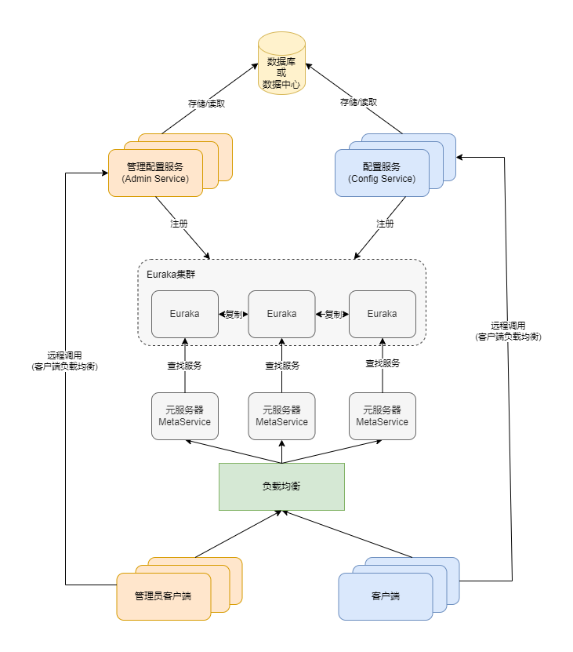

# 架构设计

## 一、架构概览

在右上角的Config Service中，提供配置的读取、推送等功能，服务对象为各个客户端。

左上角的Admin Service则提供配置的修改、发布等功能，服务对象为管理客户端。

对于Config Service和Admin Service，我们推荐采用多实例部署。

在Eureka之上，我们引入了一层Meta Server，用于封装Eureka的服务发现接口，以适配非Java客户端的HTTP请求。

各个客户端通过域名访问Meta Server，获取Config Service的服务列表（IP+Port），然后直接通过IP+Port访问服务，同时在客户端一侧会进行负载均衡和错误重试处理。

管理客户端同样通过域名访问Meta Server，获取Admin Service的服务列表（IP+Port），然后直接通过IP+Port访问服务，同时在管理客户端端会进行负载均衡和错误重试处理。

为了简化部署并提高可靠性，实际上我们会将Config Service、Eureka和Meta Server这三个逻辑角色部署在同一个JVM进程中。

## 二、各个模块介绍

### 1 配置服务 Config Service
提供配置获取接口，提供配置更新推送接口（基于Http long polling）

服务端使用Spring DeferredResult实现异步化，从而大大增加长连接数量

接口服务对象为各个客户端

### 2 管理配置服务 Admin Service
提供配置管理接口，提供配置修改、发布等接口

接口服务对象为管理客户端

### 3 元服务器 Meta Server
Meta Server从Eureka获取Config Service和Admin Service的服务信息，相当于是一个Eureka的客户端

增设一个Meta Server的角色既可以封装服务发现的细节，也可以兼容非Java客户端。
对于客户端和管理客户端而言，可以永远通过一个Http接口获取Admin Service和Config Service的服务信息，而不需要关心背后实际的服务注册和发现组件

Meta Server只是一个逻辑角色，在部署时和Config Service是在一个JVM进程中的，所以IP、端口和Config Service一致

### 4 Eureka
基于Eureka和Spring Cloud Netflix提供服务注册和发现

Config Service和Admin Service会向Eureka注册服务，并保持心跳

为了简单和可靠起见，目前Eureka在部署时和Config Service是在一个JVM进程中的（通过Spring Cloud Netflix）

### 5 管理客户端
提供交互式命令行界面供用户管理配置

通过Meta Server获取Admin Service服务列表（IP+Port），通过IP+Port访问服务，
在客户端侧做load balance、错误重试

### 6 客户端
提供的客户端程序，为应用提供配置获取、实时更新等功能

通过Meta Server获取Config Service服务列表（IP+Port），通过IP+Port访问服务，
在客户端侧做load balance、错误重试

## 三、FAQ

### 1 Why Eureka
我们为什么选择Eureka作为服务注册中心，而不是传统的ZooKeeper或Etcd呢？我总结了以下几个主要原因：

1. Eureka提供完整的Service Registry和Service Discovery实现：
   Eureka提供了完善的实现，并且经受住了Netflix自身生产环境的考验，使用起来相对可靠，让人更加放心。

2. 与Spring Cloud完美集成：
   我们的项目使用了Spring Cloud和Spring Boot，而Spring Cloud还提供了一套完善的开源代码来整合Eureka，因此使用起来非常便利。

3. 支持内嵌启动：
   Eureka支持在我们应用自身的容器中启动，这意味着我们的应用启动后既扮演Eureka的角色，也是服务的提供者，大大提高了服务的可用性。

4. 开源：
   Eureka的开源性使得我们能够轻松了解其实现原理并排查问题，这也是我们选择Eureka的重要考量因素。

