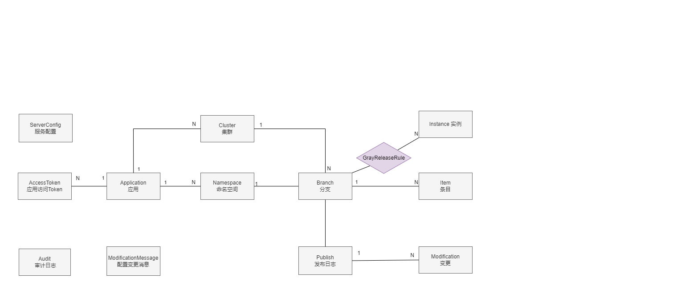
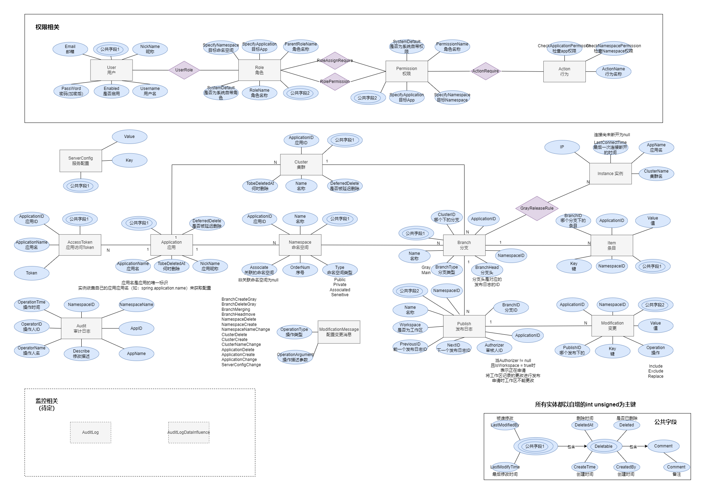

# 实体关系设计

## 一、配置管理相关

1. Application 表示一种应用程序。

2. Cluster 表示某个集群中应用程序的部署情况。

3. Namespace 代表一组配置项。在这个项目中，可以将配置项分组，每个组称为一个Namespace。同一个Namespace在不同的Cluster中的配置可以有所不同，这样可以实现对不同集群下的配置进行特殊处理。

4. Branch 代表一个版本分支。由于不同Cluster下同一Namespace中的配置可以不同，因此只有同时知道Cluster和Namespace才能确定某一组配置的版本分支。初始配置只有一个分支。每次进行灰度发布会新增一个灰度分支，反之，每次合并灰度分支将减少一个灰度分支。

5. Publish 表示一次配置发布操作。

6. Modification 表示在本次配置发布中发生了哪些变更。

7. Item 表示当前分支中的配置项。

8. Instance 表示连接到Config Service的实例。

9. ServerConfig 表示服务端的配置项。将服务端的配置项存储在数据库中有助于管理客户端对服务端配置的修改。

10. Audit 表示一条修改日志记录。

11. ModificationMessage 表示配置发布的消息。每次进行配置发布都会新增一条ModificationMessage，用于通知ConfigService更新并推送配置。

## 二、权限相关

1. User 表示一个用户的身份。

2. Rule 表示权限管理中的角色。

3. Permission 表示一项权限或许可。

4. Action 表示可以执行的操作或行为。

## 三、总览
