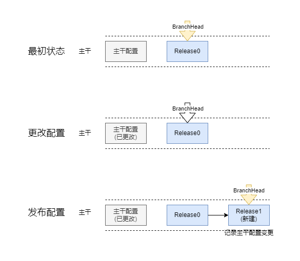
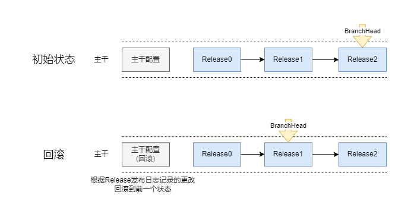
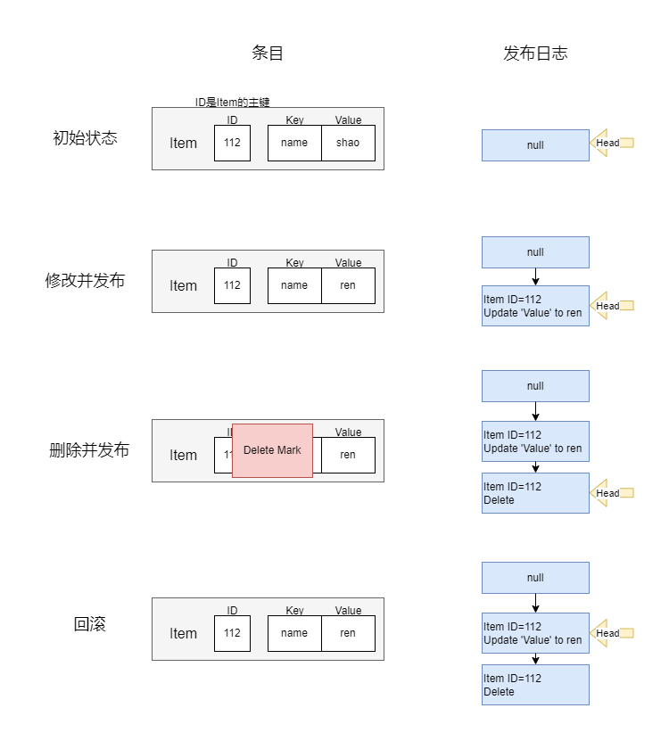
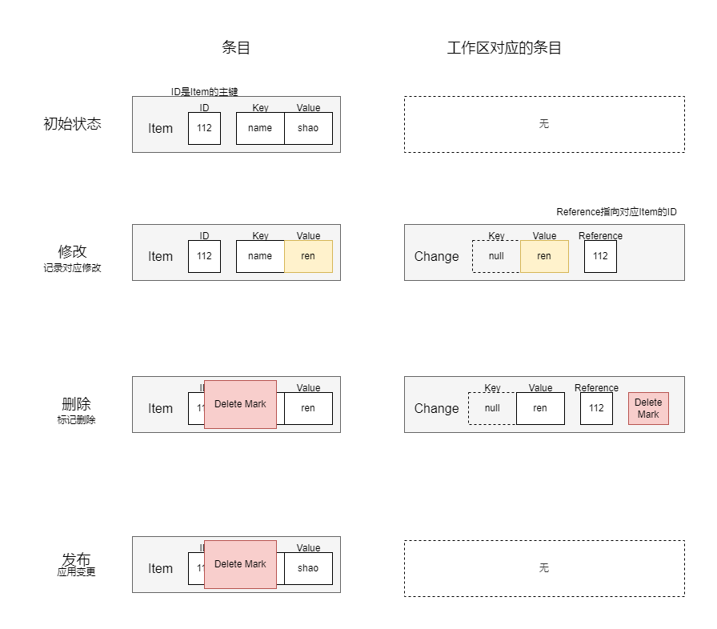
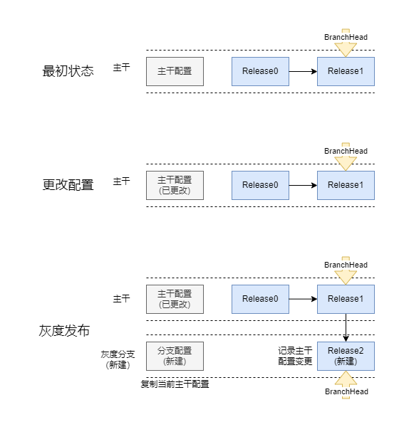

# 配置版本管理功能设计

## 一、简介
在这个项目中，我们已经实现了配置版本管理的功能。我们使用了分支的方式来进行版本管理，每组配置都拥有自己的分支。每个分支包含一系列版本（同时也是发布日志Publish）。

在每个分支中，存在一个指向当前版本的指针（Head）。通过移动指针，我们可以实现版本的前进或回滚操作。

配置发布：

配置回滚：

每次进行配置发布时，都会生成一个发布日志，其中会记录本次发布与上一次发布不同的地方。

当更新配置时，发布日志将记录本次发布条目与上一次发布不同之处。

当删除配置时，发布日志会指出某条条目已被删除，并为配置条目添加一个“delete mark”（并未真正从硬盘上删除）。

当创建配置时，发布日志会记录该配置条目的所有信息。

下面一幅图展现了在本项目中如何对一条配置进行版本管理：

## 二、工作区

既然已经有地方存储已发布的配置，那么尚未发布的配置存放在何处呢？

每组配置都拥有一个特殊的发布日志，也称为工作区（workspace），工作区中保存着已经修改但尚未发布的条目。

每次进行配置发布实际上是将工作区中的配置更改信息应用到当前配置上，并将其迁移至发布日志中。

## 三、灰度发布
每次进行灰度发布实际上是创建了一个新的“灰度分支”，并将当前主干配置的一个副本复制到灰度分支中。

在灰度分支上，可以独立地对配置进行添加、删除、查询和修改。

在合适的时机，可以将灰度分支和主干进行合并，将灰度分支中的内容覆盖到主干上，然后销毁灰度分支。
